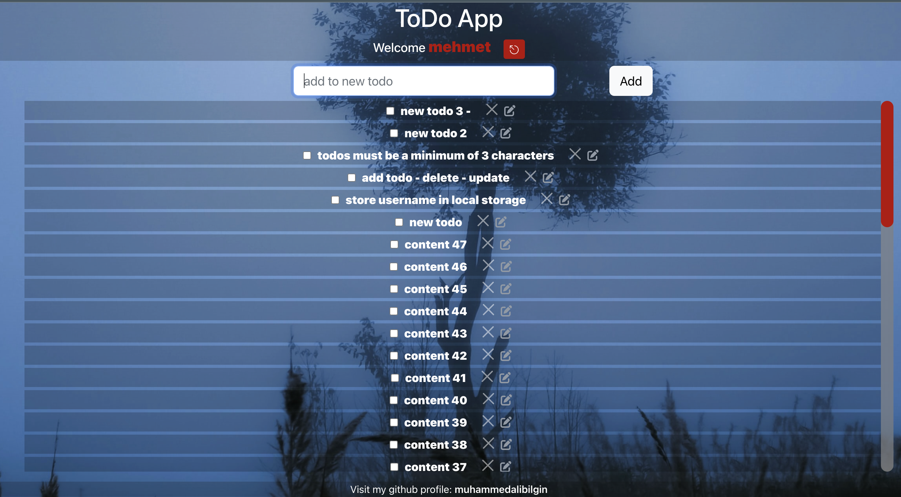

# todo-app-react-2

-This is a To Do app with created using **Create React App** and **mockAPI** was used for the api.

-Also used when creating: **React Context Api**, **Bootstrap 5**, **Font-Awesome**

-After cloning the project you can run it with `npm start`.

-And you can also view the finished project live here;
[https://mali-todo-2.netlify.app/](https://mali-todo-2.netlify.app/)

